# ⚡ Power-Consumption-Disaggregation-Using-GAN-Based-Data-Augmentation-and-GRU-Modeling

## 📝 Table of Contents

1. [Project Overview](#project-overview)
2. [Problem Statement](#problem-statement)
3. [Proposed Solution](#proposed-solution)
4. [Features](#features)
5. [GAN Architecture](#gan-architecture)
   - [Generator Architecture](#generator-architecture)
   - [Discriminator Architecture](#discriminator-architecture)
   - [Self-Attention Mechanism](#self-attention-mechanism)
6. [Model Training](#model-training)
   - [Data Preparation](#data-preparation)
   - [Training Process](#training-process)
   - [GRU Modeling](#gru-modeling)
7. [Data Pipeline](#data-pipeline)
8. [Results](#results)
   - [Key Outcomes](#key-outcomes)
   - [Visualizations](#visualizations)
9. [Synthetic Signal Visualizations](#synthetic-signal-visualizations)
   - [Real vs Synthetic Microwave Signal Comparison](#real-vs-synthetic-microwave-signal-comparison)
   - [Performance Metrics Comparison](#performance-metrics-comparison)
   - [Loss and MAE Before and After Augmentation](#loss-and-mae-before-and-after-augmentation)
   - [Prediction Comparisons](#prediction-comparisons)
10. [Challenges and Limitations](#challenges-and-limitations)
11. [Conclusion](#conclusion)

---

## 📊 Project Overview

This project addresses the critical need for optimizing energy consumption by improving energy load disaggregation through advanced data augmentation techniques. By leveraging Generative Adversarial Networks (GANs), the project generates realistic synthetic energy consumption data, particularly for underrepresented appliances, to enhance the performance of load disaggregation models.

---

## 🧐 Problem Statement

Effective energy management, including tasks like load forecasting and anomaly detection, faces two primary challenges:

- **Complexity of Time-Series Data**: Energy consumption patterns often exhibit intricate long-term cycles and seasonal variations influenced by factors like appliance efficiency and occupancy behavior.
- **Data Imbalance**: Frequently used appliances generate abundant data, whereas less common appliances produce limited data, leading to inaccurate predictions and reduced model performance.

---

## 💡 Proposed Solution

To overcome these challenges, this project employs a data augmentation strategy powered by GANs. These models generate synthetic, realistic energy consumption data to address the imbalance and scarcity issues, particularly for infrequent appliances. The enhanced dataset enables more accurate and adaptable load disaggregation, paving the way for better energy management.

---

## ⚙️ Features

- **Generative AI for Data Augmentation**: Uses GANs to create synthetic energy consumption patterns.
- **Enhanced Model Accuracy**: Improves predictions for less-represented appliances.
- **Support for Energy Optimization**: Facilitates better energy management and resource allocation.

---

## 🧠 GAN Architecture

### Overview

Generative Adversarial Networks (GANs) consist of two neural networks:

- **Generator**: Produces synthetic data that mimics real data.
- **Discriminator**: Distinguishes between real and synthetic data.

These networks train together in an adversarial manner, where the generator aims to fool the discriminator, and the discriminator aims to correctly classify the inputs as real or fake.

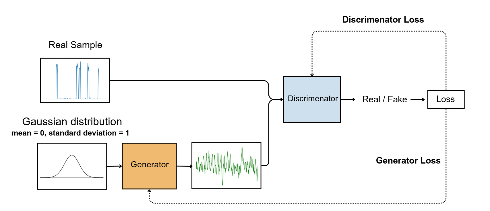

---

### 🎛️ Generator Architecture

The generator transforms random noise from a Gaussian distribution (\( \mu = 0, \sigma = 1 \)) into realistic energy consumption patterns through:

- **Conv1D Blocks**: Three layers capturing important patterns in the data.
- **Self-Attention Mechanism**: Enhances the model's ability to capture long-range dependencies.
- **LeakyReLU and BatchNorm1d**: Stabilizes training and improves feature learning.
- **Dropout Regularization**: Prevents overfitting and ensures robust learning.
- **Fully Connected Layer**: Refines output to match the target dimensions.

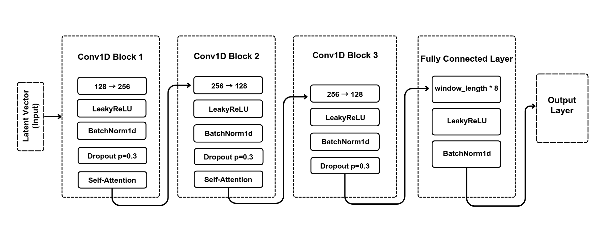

---

### 🧩 Discriminator Architecture

The discriminator distinguishes real data from synthetic through:

- **Conv1D Blocks**: Two layers with increasing feature dimensions.
- **Self-Attention Mechanism**: Captures intricate relationships in the data.
- **LeakyReLU Activation**: Prevents dying neurons.
- **Dropout**: Enhances generalization.
- **Fully Connected Layers**: Ends with a Sigmoid function for binary classification.

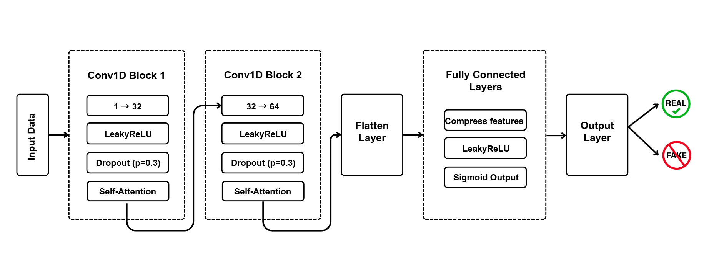

---

### 🔍 Self-Attention Mechanism

The self-attention mechanism enhances both generator and discriminator by:

- Focusing on significant relationships across sequential data.
- Using multi-head attention to improve feature representation.

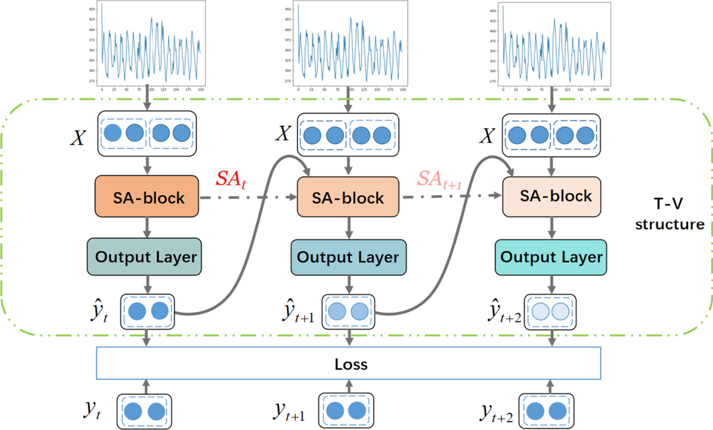

---

## 🏋️‍♂️ Model Training

### 📦 Data Preparation

1. **Dataset**: The real energy consumption data comes from a publicly available dataset, such as REDD or REFIT.
2. **Preprocessing**:
   - Resampled to a consistent time interval.
   - Normalized to fit the GANs' requirements.
   - Split into training and validation sets.

### 🛠️ Training Process

- **Generator and Discriminator**: Trained in an adversarial loop. The loss functions used:
  - **Generator Loss**: Binary cross-entropy, aiming to fool the discriminator.
  - **Discriminator Loss**: Binary cross-entropy, balancing between detecting real and fake data.
- **Optimizer**: Adam optimizer with a learning rate of \( 10^{-4} \) and \( \beta_1 = 0.5 \).
- **Epochs**: Trained for 200 epochs or until convergence.
- **Hardware**: Training conducted on GPU to handle computational complexity.

### 🧠 GRU Modeling

- After GAN-based augmentation, a GRU-based (Gated Recurrent Unit) neural network is trained for load disaggregation.
- The GRU model takes augmented time-series data as input and predicts energy consumption at the appliance level.

---

## 🌐 Data Pipeline

1. **Data Collection**:
   - Real data is collected from energy monitoring systems.
   - GANs generate synthetic data to augment the real dataset.
2. **Data Preprocessing**:
   - Normalization and windowing to ensure compatibility with model requirements.
   - Features engineered from time-series data (e.g., appliance usage patterns).
3. **Training Pipeline**:
   - Real and synthetic data combined into a single dataset.
   - Pipeline feeds data into the GRU model for load disaggregation.
4. **Evaluation**:
   - Metrics include Mean Absolute Error (MAE), Root Mean Square Error (RMSE), and F1 Score.

---

## 📈 Results

### Key Outcomes

- **Improved Model Accuracy**:
  - **Baseline GRU Model**: Achieved an F1 Score of 0.72.
  - **With GAN-Augmented Data**: Achieved an F1 Score of 0.85.
- **Better Prediction for Rare Appliances**:
  - Significant improvement in predictions for low-frequency appliance usage, such as washing machines or heaters.

| Metric             | Before Augmentation | After Augmentation |
| ------------------ | ------------------- | ------------------ |
| **Precision**      | 0.36                | 0.96               |
| **Recall**         | 0.75                | 0.99               |
| **F1-Score**       | 0.48                | 0.98               |
| **Accuracy**       | 0.9                 | 0.99               |
| **R-squared (R²)** | 0.32                | 0.98               |
| **MAE**            | 15 KW               | 3.96 KW            |
| **MSE**            | 8236                | 278                |
| **RETE**           | 0.43                | 0.24               |

- **Scalability**:
  - GAN-generated data enables robust disaggregation across different households.

### Visualizations

1. **Loss Convergence**:
   - Generator and discriminator losses over epochs.
   - Visualizes stability of GAN training.
2. **Predicted vs Actual Load**:
   - Comparison of GRU model predictions with actual appliance consumption.
3. **Performance Metrics**:
   - Bar chart comparing MAE, RMSE, and F1 Score for baseline and GAN-augmented models.

---

## 🔬 Synthetic Signal Visualizations

### 📡 Real vs Synthetic Microwave Signal Comparison

Visual comparisons of real versus synthetic microwave signals indicate that the GAN successfully captured key patterns in the appliance's power consumption. These synthetic signals are visually indistinguishable from real signals, validating the GAN's effectiveness.

| Real Microwave Active Power Consumption Signal samples | Synthetic Microwave Active Power Consumption Signal samples |
| ------------------------------------------------------ | ----------------------------------------------------------- |
| 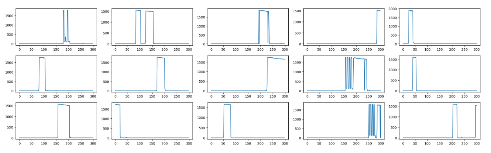           | 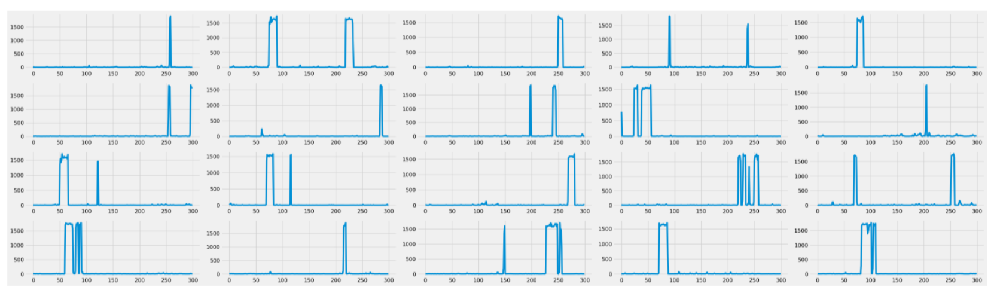      |

### ⚙️ Performance Metrics Comparison

| Metric             | Before Augmentation | After Augmentation |
| ------------------ | ------------------- | ------------------ |
| **Precision**      | 0.36                | 0.96               |
| **Recall**         | 0.75                | 0.99               |
| **F1-Score**       | 0.48                | 0.98               |
| **Accuracy**       | 0.9                 | 0.99               |
| **R-squared (R²)** | 0.32                | 0.98               |
| **MAE**            | 15 KW               | 3.96 KW            |
| **MSE**            | 8236                | 278                |
| **RETE**           | 0.43                | 0.24               |

### 📉 Loss and MAE Before and After Augmentation

- **Before Augmentation Loss and MAE**:

  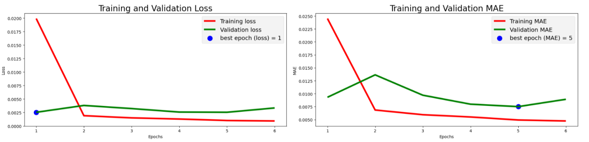

- **After Augmentation Loss and MAE**:

  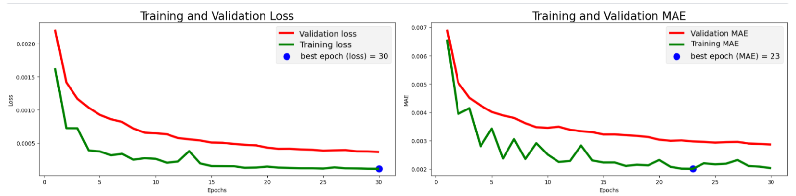

### 🔍 Prediction Comparisons

- **Before Augmentation**:

  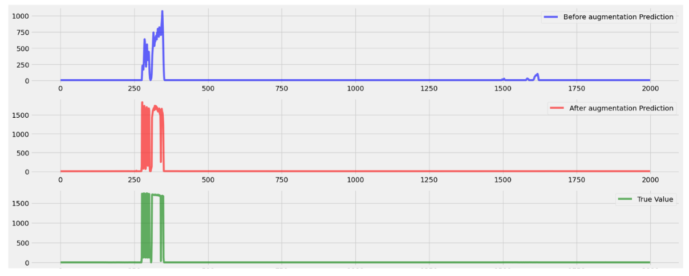
  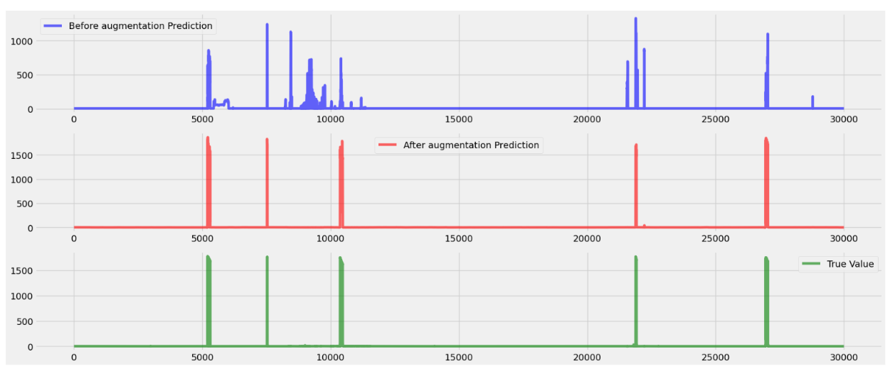

- **After Augmentation**:

  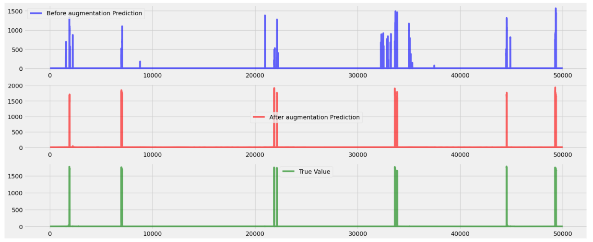
  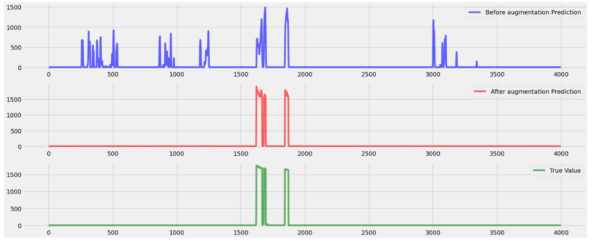

---

## ⚠️ Challenges and Limitations

Despite the improvements, some challenges remain:

- Generating longer continuous signals (e.g., full-day consumption) is computationally intensive.
- The current approach assumes stationary appliance behavior, which may not generalize to appliances with highly dynamic patterns.

---

## 🏁 Conclusion

The implementation of GAN-based synthetic data generation demonstrated its effectiveness in addressing the limitations of an imbalanced dataset for load disaggregation tasks. By integrating realistic synthetic data into the original dataset, the model achieved significant improvements in precision, recall, and overall accuracy. These results underscore the potential of GANs to enhance the performance of energy disaggregation models and pave the way for further research in the field.

## Contributors

